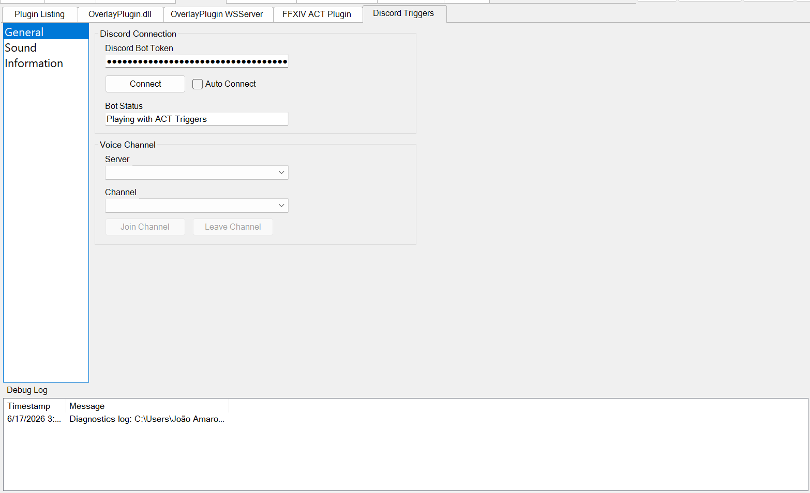
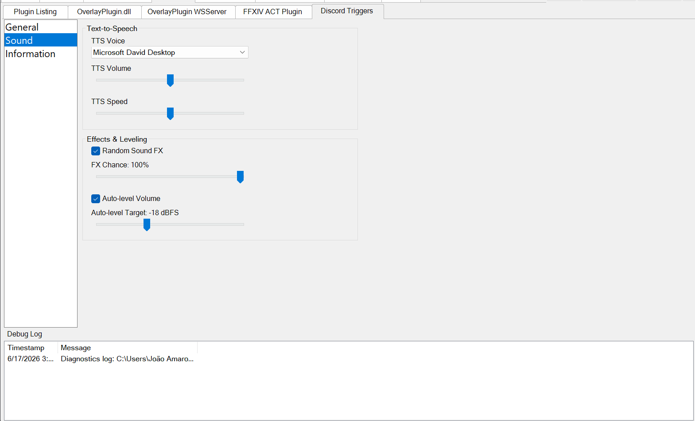

# ACT Discord Triggers

[](https://github.com/jlagedo/ACT-Discord-Triggers/actions/workflows/ci.yml)
[](LICENSE)

An [Advanced Combat Tracker](https://advancedcombattracker.com/) (ACT) plugin
that plays your triggers — text-to-speech and sound effects — through a Discord
bot in a voice channel, so your whole party hears them.

Works with ACT **Custom Triggers** and **Triggernometry**.

> 🔀 **Maintained fork.** This is the actively maintained continuation of
> [Makar8000/ACT-Discord-Triggers](https://github.com/Makar8000/ACT-Discord-Triggers),
> revived after Discord's DAVE encryption rollout broke the original in early
> 2026. See [Acknowledgments](#acknowledgments) for full credit to the original
> author.

## Screenshots

| General — connect & join a voice channel | Sound — TTS, effects & leveling |
| :---: | :---: |
|  |  |

## Features

- 🔊 **TTS in voice chat** — fire trigger text-to-speech straight into a Discord
  voice channel.
- 🎵 **Sound-file triggers** — play `.wav` sound effects through the bot.
- 🎚️ **Concurrent playback** — overlapping triggers mix together instead of
  queueing, so nothing gets dropped or delayed.
- 🎲 **Random sound effects** — optionally pick a random sound from a set each
  time a trigger fires.
- 📈 **Loudness auto-leveling** — automatic RMS normalization keeps every clip
  at a consistent volume.
- 🔐 **Discord DAVE support** — speaks Discord's end-to-end voice encryption,
  which is now required to join voice channels.

## Requirements

- Windows
- [Advanced Combat Tracker](https://advancedcombattracker.com/)
- A Discord bot token ([setup guide below](#setup))

> Node.js is **bundled** in the release archive — you do **not** need to install
> it separately.

## Installation

1. Download the latest `ACT_DiscordTriggers-*.zip` from the
   [Releases page](https://github.com/jlagedo/ACT-Discord-Triggers/releases).
2. Right-click the downloaded zip → **Properties** → tick **Unblock** → OK.
   (Windows flags `node.exe`/DLLs downloaded from the internet; skipping this
   can trip SmartScreen or antivirus.)
3. Extract it into your ACT plugins folder:
   `%AppData%\Advanced Combat Tracker\Plugins`. You should end up with a
   `Plugins\ACT_DiscordTriggers\` folder containing `ACT_DiscordTriggers.dll`,
   `node.exe`, `bundle.js`, and `node_modules\`. **Keep all of these files
   together in that folder.**
4. In ACT, open the **Plugins** tab → **Browse…**, select
   `ACT_DiscordTriggers.dll` inside that folder, and click **Add/Enable
   Plugin**.

## Setup

Follow the
[First-Time Setup Guide](https://github.com/Makar8000/ACT-Discord-Triggers/wiki/First-Time-Setup-Guide)
to create a Discord bot, invite it to your server, and connect it to the
plugin. (The guide is hosted on the original project; the setup steps are
unchanged.)

## Updating

Replace the whole plugin folder with the new release — don't just swap the
`.dll`. The plugin runs alongside the bundled `node.exe` / `bundle.js` /
`node_modules/`, and those are updated together.

---

## For developers

The plugin targets .NET Framework 4.8 (the only runtime ACT loads), but Discord
voice now runs in a separate Node.js process. This is what makes DAVE possible
without dropping ACT compatibility:

```
ACT (net48) ─loads─▶ ACT_DiscordTriggers.dll (net48)
                            │ spawns
                            ▼
                     node.exe + bundle.js (discord.js + @snazzah/davey)
                            ▲
                            │ named pipe (length-prefixed JSON frames)
                            ▼
                ACT_DiscordTriggers.dll IPC client
```

Discord enforced [DAVE](https://daveprotocol.com/) end-to-end encryption on
voice in early 2026, and [Discord.Net 3.19](https://github.com/discord-net/Discord.Net/releases/tag/3.19.1)
(the first version with DAVE) dropped .NET Framework support — so the old
in-process voice path became unfixable. Moving voice into a bundled Node bridge
keeps ACT on net48 while staying current with Discord. The full design rationale
and alternatives considered are documented in
[`CLAUDE.md`](CLAUDE.md).

### Building

One command from a clean clone produces `release/` with everything an end user
drops into ACT's plugins directory:

```
cd DiscordBridge-node && npm ci && cd ..
pwsh ./build.ps1
```

`build.ps1` builds the plugin (`dotnet build` — net48 reference assemblies
auto-restore via NuGet, Costura.Fody merges into a single DLL), type-checks and
bundles the bridge, copies `node.exe`, stages the external `node_modules/`, runs
a spawn self-test (asserts `BRIDGE_READY`), and assembles `release/`.

For bridge-only iteration, use the npm scripts in `DiscordBridge-node/`:
`npm run typecheck`, `npm run bundle`, `npm test`.

### Tests

```
dotnet test Tests/Tests.csproj            # C# (net48): protocol + IPC + integration
cd DiscordBridge-node && npm test         # JS (tsx + node:test)
```

Integration tests require the bridge to be built first (they spawn
`DiscordBridge-node/dist/node.exe` with `bundle.js`).

### Built with

- [.NET Framework 4.8](https://dotnet.microsoft.com/download/dotnet-framework) (plugin + tests)
- [Node.js 22+](https://nodejs.org/) (bridge runtime)
- [NAudio](https://github.com/naudio/NAudio) (PCM resampling in plugin)
- [discord.js](https://github.com/discordjs/discord.js) + [@discordjs/voice](https://github.com/discordjs/voice) (bridge)
- [@snazzah/davey](https://github.com/snazzah/davey) (DAVE E2EE)

## Acknowledgments

This project began as a fork of
[Makar8000/ACT-Discord-Triggers](https://github.com/Makar8000/ACT-Discord-Triggers)
by [@Makar8000](https://github.com/Makar8000), who created and maintained the
original plugin. The DAVE rewrite landed as
[PR #82](https://github.com/Makar8000/ACT-Discord-Triggers/pull/82) upstream,
after which maintenance was handed off to this fork. All credit for the original
design and years of upkeep goes to Makar8000 — thank you.

## License

[MIT](LICENSE) — Copyright (c) 2017 Marcus Terry, Copyright (c) 2026 João Amaro
Lagedo.
